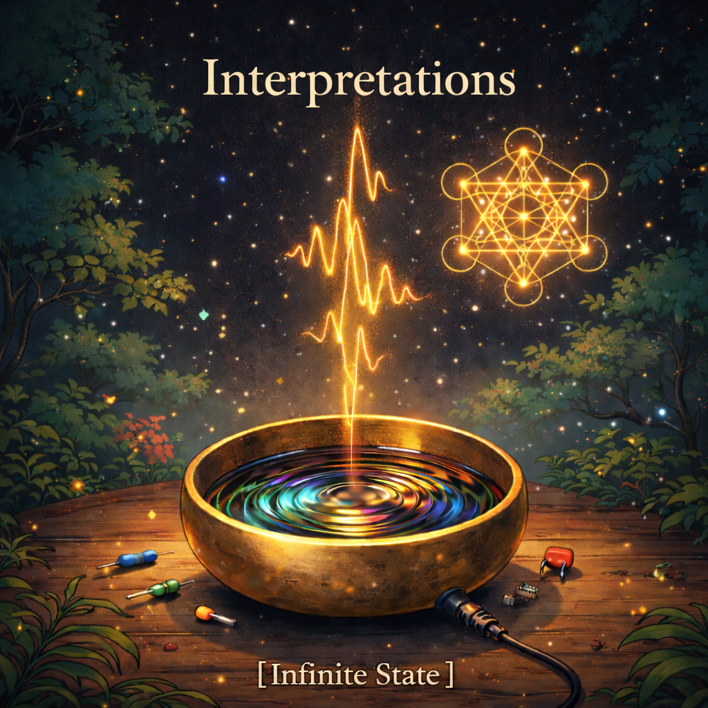

```
    _       _                        _        _   _
   (_)_ __ | |_ ___ _ __ _ __  _ __ | |_ __ _| |_(_) ___  _ __  ___
   | | '_ \| __/ _ \ '__| '_ \| '__/ _ \ __/ _` | __| |/ _ \| '_ \/ __|
   | | | | | ||  __/ |  | |_) | | |  __/ || (_| | |_| | (_) | | | \__ \
   |_|_| |_|\__\___|_|  | .__/|_|  \___|\__\__,_|\__|_|\___/|_| |_|___/
                         |_|          ~ written in python ~
```

# Interpretations

An album of compositions written in Python using [pytheory](https://github.com/kennethreitz/pytheory).

Each track is a `.py` file. Run it to hear it.




## Usage

```bash
uv sync
uv run play
```

On first run, you'll be prompted to render all tracks to WAV (parallel, ~3-4 min). After that, playback is instant.

**Interactive player** — animated track picker with album order:

```bash
uv run play                                                    # pick from list
uv run play tracks/the_temple.py                                      # play specific track
```

**Picker controls:**

| Key | Action |
|-----|--------|
| `↑`/`↓` | Navigate (wraps around) |
| `Enter` | Play track (from WAV cache if available) |
| `r` | Render selected track to WAV |
| `a` | Play all tracks in album order |
| `R` | Render all tracks (4 parallel workers) |
| `q` | Quit |

**Playback options:**

```bash
uv run play tracks/acid_reign.py --from 17 --to 32                   # measure range
uv run play tracks/the_temple.py --from-time 3:30                     # seek to time
uv run play tracks/ghost_protocol.py --solo arp,kick                  # solo parts
uv run play tracks/deep_time.py --mute wind                           # mute parts
uv run play tracks/the_temple.py --pitch 440                          # override tuning
uv run play tracks/acid_reign.py --bpm 160                            # override tempo
uv run play tracks/silk_road.py --loop 3                              # loop playback
```

**Export & inspect:**

```bash
uv run play tracks/raga_midnight.py -o raga.wav                       # export WAV
uv run play tracks/the_interruption.py --info                         # show metadata
uv run play tracks/the_interruption.py --parts                        # list parts
uv run play --list                                                    # list all tracks
```

`Ctrl+C` to stop playback.

See the [changelog](CHANGELOG.md) for detailed track history.

## Tracklist

| # | Track | Key | BPM | Tuning | Vibe |
|---|-------|-----|-----|--------|------|
| 1 | [Raga Midnight](tracks/raga_midnight.py) | D Phrygian | 90 | shruti / just | Sitar raga with 808 drop |
| 2 | [Shruti Lofi](tracks/shruti_lofi.py) | D minor | 75 | shruti / just | Microtonal lo-fi hip hop |
| 3 | [Ghost Protocol](tracks/ghost_protocol.py) | F minor | 128 | equal | Trip-hop → trance build |
| 4 | [Silk Road](tracks/silk_road.py) | D minor | 95 | equal | World music caravan |
| 5 | [The Observatory](tracks/the_observatory.py) | G minor | 112 | equal | Chapel through shortwave |
| 6 | [Acid Reign](tracks/acid_reign.py) | A minor | 140 | equal | Dual 303 acid |
| 7 | [Beast Mode](tracks/beast_mode.py) | G minor | 135 | equal | Trap + sitar hook |
| 8 | [Apex](tracks/apex.py) | Eb minor | 140 | equal | The fastest, the hardest |
| 9 | [Voltage](tracks/voltage.py) | F minor | 138 | equal | Raw oscillators |
| 10 | [An Exception Occurred](tracks/an_exception_occurred.py) | Eb major→minor | 80 | equal | Mental health arc |
| 11 | [Voices](tracks/voices.py) | F# minor | 65 | equal | Auditory hallucinations |
| 12 | [Intrusive](tracks/intrusive.py) | Bb minor | 92 | equal | Invasive thoughts |
| 13 | [Gravity](tracks/gravity.py) | C minor | 88 | equal | Hip hop + eastern |
| 14 | [The Interruption](tracks/the_interruption.py) | D minor | 85 | equal | String quartet vs DnB |
| 15 | [Sleight of Hand](tracks/sleight_of_hand.py) | D minor | 100 | equal | Nine genre shifts |
| 16 | [Waveforms](tracks/waveforms.py) | F minor | 118 | equal | Synth showcase |
| 17 | [Emergence](tracks/emergence.py) | E minor | 100 | equal | Acoustic births electronic |
| 18 | [Chakra](tracks/chakra.py) | G→C→E major | 60→135 | shruti / A=432 | Root to crown journey |
| 19 | [The Temple](tracks/the_temple.py) | A Phrygian | 65 | shruti / A=432 | Devotional reverb |
| 20 | [The Dialogue](tracks/the_dialogue.py) | E Phrygian | 75 | shruti / A=432 | Human + machine |
| 21 | [Cathedral](tracks/cathedral.py) | D minor | 60 | equal | Ancient stone |
| 22 | [Tape Memory](tracks/tape_memory.py) | Db minor | 90 | equal | Mellotron + new synths |
| 23 | [Music Box Factory](tracks/music_box_factory.py) | G major | 108 | equal | Tuned percussion only |
| 24 | [Deep Time](tracks/deep_time.py) | B minor | 40 | just | 7.5 min ambient drone |

## License

ISC
